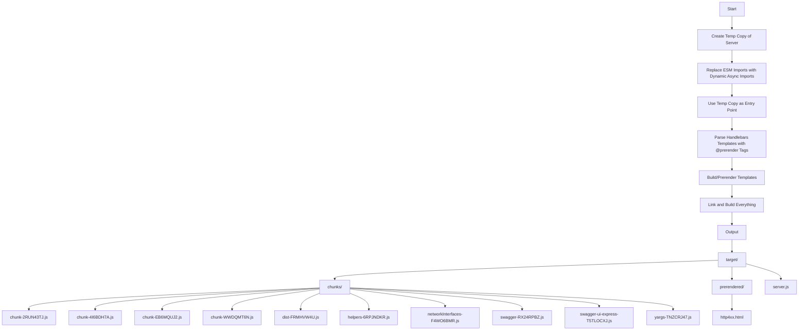

# Express Base Project

This project is a backend web application built with Express.js, using Bun for scripting and testing. Below is a detailed guide on the project structure, its dependencies, and how to work with it.

## Installation

### Prerequisites
- [Node.js](https://nodejs.org/) (version X.X.X)
- [Bun](https://bun.sh/)
- [Docker](https://www.docker.com/)

### Steps
1. Clone the repository:
```sh
git clone https://github.com/yourusername/yourproject.git
cd yourproject
```

2. Install dependencies:
```sh
bun install
```

## Usage

### Scripts
This project uses several npm scripts for common tasks:

- **`start`**: Runs the application.
```sh
bun src/server.ts
```

- **`dev`**: Runs the application in watch mode. The server restarts automatically when files change.
```sh
bun --watch src/server.ts
```

- **`docker`**: Builds the Docker image, stops any running containers, and starts the new container.
```sh
sudo docker-compose build && docker-compose down && docker-compose up
```

- **`build`**: Builds the project for production.
```sh
bun scripts/build/index.js
```

- **`preview`**: Previews the built project.
```sh
bun target/server.js
```

- **`preview:prod`**: Previews the built project in production mode.
```sh
NODE_ENV=production bun target/server.js
```

- **`test`**: Runs the test suite.
```sh
jest
```

- **`make:swagger`**: Generates the Swagger JSON documentation.
```sh
bun scripts/generate-swagger-json.js
```

### Running the Project
To start the project in development mode:
```sh
bun dev
```

To build the project:
```sh
bun build
```

To preview the built project:
```sh
bun preview
```

To run the project in production mode:
```sh
bun preview:prod
```

To generate the Swagger documentation:
```sh
bun make:swagger
```

## Project Structure

```plaintext
./
├── bun.lockb*
├── docker-compose.yml
├── Dockerfile
├── .dockerignore
├── .env.example
├── .gitignore
├── jest.config.js
├── latex/
│   └── ...
├── __logs__/
│   ├── log-file.log
│   ├── parse-logs.sh
│   └── rotate-logs.sh
├── __mocks__/
│   └── express-handlebars.js
├── package.json
├── README.md
├── scripts/
│   ├── build/
│   │   ├── build/
│   │   │   ├── build.js
│   │   │   └── index.js
│   │   ├── index.js
│   │   ├── prerender/
│   │   │   ├── index.js
│   │   │   └── prerender.js
│   │   └── utils/
│   │       ├── fileReplacements.js
│   │       ├── fileUtils.js
│   │       ├── index.js
│   │       └── templateUtils.js
│   └── generate-swagger-json.js
├── src/
│   ├── configs/
│   │   └── index.ts
│   ├── controllers/
│   │   └── index.ts
│   ├── db/
│   │   └── seeds/
│   │       └── index.ts
│   ├── interfaces/
│   │   └── index.ts
│   ├── middlewares/
│   │   ├── cors.ts
│   │   ├── logger.ts
│   │   └── swagger.ts
│   ├── routes/
│   │   ├── index.ts
│   │   ├── product.ts
│   │   └── user.ts
│   ├── server.ts
│   ├── services/
│   │   └── index.ts
│   ├── tests/
│   │   └── product.test.ts
│   ├── types/
│   │   └── index.ts
│   └── utils/
│       ├── isPortInUse.ts
│       └── networkInterfaces.ts
├── static/
│   ├── ...
│   ├── site.webmanifest
│   └── v1/
│       └── swagger.json
├── target/
│   └── ...
├── tsconfig.json
└── views/
    └── ...
```
#### Directories

- **__logs__/**
  - **log-file.log**: Log file for application logs.
  - **parse-logs.sh**: Script to parse logs.
  - **rotate-logs.sh**: Script to rotate logs.

- **__mocks__/**
  - **express-handlebars.js**: Mock file for Express Handlebars.

- **scripts/**: Contains various scripts for building, testing, and generating documentation.
  - **build/**: Scripts related to building the project.
  - **generate-swagger-json.js**: Script to generate Swagger JSON documentation.

- **src/**: Main source code directory.
  - **configs/**: Configuration files.
  - **controllers/**: Controllers for handling routes.
  - **db/**: Database-related files and seeds.
  - **interfaces/**: TypeScript interfaces.
  - **middlewares/**: Custom middleware functions.
  - **routes/**: Route definitions.
  - **server.ts**: Entry point for the server.
  - **services/**: Business logic and services.
  - **tests/**: Test files.
  - **types/**: Type definitions.
  - **utils/**: Utility functions.

- **static/**: Static files served by the application.
  - **site.webmanifest**: Web app manifest.
  - **v1/**: Versioned static files.

- **tsconfig.json**: TypeScript configuration file.

- **views/**: Templates for rendering HTML content.
  - **email/**: Email templates.
    - **reset-password.hbs**: Template for reset password email.
    - **welcome.hbs**: Template for welcome email.
  - **layouts/**: Layout templates.
    - **email/**: Email layouts.
      - **base.hbs**: Base layout for emails.
      - **newsletter.hbs**: Layout for newsletters.
    - **web/**: Web page layouts.
      - **error.hbs**: Layout for error pages.
      - **main.hbs**: Main layout for web pages.
  - **partials/**: Partial templates for reuse.
    - **email/**: Email partials.
      - **footer.hbs**: Footer partial for emails.
      - **header.hbs**: Header partial for emails.
    - **web/**: Web page partials.
      - **footer.hbs**: Footer partial for web pages.
      - **header.hbs**: Header partial for web pages.
  - **web/**: Web page templates.
    - **error.hbs**: Error page template.
    - **home.hbs**: Home page template.

### Logging with Morgan

We use Morgan for logging because it is faster, has a smaller bundle size, and is more friendly with the Linux shell. Morgan works great with tools like `awk`, making log parsing and analysis simpler and more efficient.

### Handlebars Template Engine

We use Handlebars as the template engine. The structure of the templates is as follows:

```plaintext
└── views/
    ├── email/
    │   ├── reset-password.hbs
    │   └── welcome.hbs
    ├── layouts/
    │   ├── email/
    │   │   ├── base.hbs
    │   │   └── newsletter.hbs
    │   └── web/
    │       ├── error.hbs
    │       └── main.hbs
    ├── partials/
    │   ├── email/
    │   │   ├── footer.hbs
    │   │   └── header.hbs
    │   └── web/
    │       ├── footer.hbs
    │       └── header.hbs
    └── web/
        ├── error.hbs
        └── home.hbs
```

### File-based Routing

We use a file-based routing structure inspired by SvelteKit/Next.js. Routes are automatically imported and integrated into the main app.

### Vite.js-like IP Bindings

We have Vite.js-like IP bindings. Using the `--host` flag, the server binds to all available networks. When `NODE_ENV` is set to production, it binds to `0.0.0.0`; otherwise, it is only accessible via `localhost`.

### Logging Levels

Logs are written to disk when they have a level of `warn` or worse, ensuring that critical issues are always logged for later analysis.

### Port Availability

Port availability is automatically checked and handled. In future updates, the application will suggest alternative ports if the default one is unavailable.

### Swagger Documentation

Swagger-UI is enabled in development mode but isn't bundled on build. Instead, a static `swagger.json` file is generated on build and served as a static file.

### CORS Configuration

CORS are static for now but will be

 dynamic using environment variables or a config file in future updates.

### Build Process

1. **Initial Setup and Copying the Server File:**
   - The original server file (`server.ts`) is duplicated to create a temporary file (`server.temp.ts`).
   - During this copying process, all ESM (ECMAScript Module) imports in the code are replaced with dynamic async imports. This modification allows for better chunk splitting during the build.
   - Modules specified in a whitelist are excluded from this replacement and retain their original import statements.

2. **Using the Temporary Server File:**
   - The temporary server file (`server.temp.ts`) becomes the new entry point for the build process. This file, with its dynamic imports, sets the stage for optimized chunk splitting.

3. **Parsing Handlebars Templates:**
   - The build script identifies Handlebars templates that contain special JavaScript code tags marked with `@prerender`.
   - These marked templates undergo a parsing process where the `@prerender` tags are recognized and processed.

4. **Prerendering Templates:**
   - The identified templates are prerendered during the build process. This means that instead of rendering these templates at runtime, they are pre-processed and rendered during the build.
   - The prerendered templates are saved and will be used in the final build, reducing the need to load and render these templates dynamically at runtime.

5. **Final Build Generation:**
   - With the temporary server file (`server.temp.ts`) as the entry point and the prerendered templates ready, the build process continues.
   - The build script compiles and bundles the project, resulting in a final build where:
     - JavaScript code is split into optimized chunks for efficient loading.
     - Prerendered templates are included for quicker response times and reduced server load during runtime.
     - The final server file (`server.js`) is generated, incorporating all the changes and optimizations from the build process.
    


For the build process, non-whitelisted module imports are replaced with dynamic async imports. This approach reduces bundle size and ensures efficient code splitting. Swagger documentation is generated using JSDoc, which isn't treated as actual code during the build, further optimizing the bundle size. We also use a custom JSDoc parser and an `@prerender` flag for some Handlebars routes, making static error pages faster in production.

The build process splits the application into smaller chunks via dynamic imports. The target structure is as follows:

```plaintext
│   ├── chunks/
│   │   ├── chunk-2RUN43TJ.js
│   │   ├── chunk-4I6BDH7A.js
│   │   ├── chunk-EB6MQUJ2.js
│   │   ├── chunk-WWDQMT6N.js
│   │   ├── dist-FRMHVW4U.js
│   │   ├── helpers-6RPJNDKR.js
│   │   ├── networkInterfaces-F4WO6BMR.js
│   │   ├── swagger-RX24RPBZ.js
│   │   ├── swagger-ui-express-T5TLOCXJ.js
│   │   └── yargs-TNZCRJ47.js
│   ├── prerendered/
│   │   └── http4xx.html
│   └── server.js
```

The build process enhances performance and efficiency by:
- Replacing ESM imports with dynamic async imports for better chunk splitting.
- Using a temporary server file as the entry point to facilitate these changes.
- Prerendering specific Handlebars templates to reduce runtime rendering.
- Compiling and bundling the project into optimized chunks and a final server build.

### Testing

Tests are done using Jest and Supertest, with mocks included for thorough testing.

### Path Aliases

Path aliases are added to simplify imports and improve code readability. The aliases are as follows:

```json
"paths": {
  "@/*": ["./src/*"],
  "@configs/*": ["./src/configs/*"],
  "@controllers/*": ["./src/controllers/*"],
  "@seeds/*": ["./src/db/seeds/*"],
  "@interfaces/*": ["./src/interfaces/*"],
  "@middlewares/*": ["./src/middlewares/*"],
  "@routes/*": ["./src/routes/*"],
  "@services/*": ["./src/services/*"],
  "@tests/*": ["./src/tests/*"],
  "@types/*": ["./src/types/*"],
  "@utils/*": ["./src/utils/*"],
  "@routes": ["./src/routes"],
  "$server": ["./src/server.ts"],
  "$build/*": ["./scripts/build/*"]
}
```
### Experimentation with Babel
Some experimentation with Babel has been done to use dynamic imports with Jest. However, the transpiler solution proved to be better, and Babel is no longer needed.
